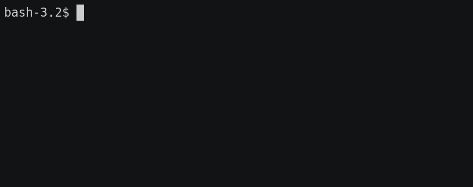

# dgstore

**Hash files and store the digests next to the files for future comparison.**

[](https://badge.fury.io/js/%40alphahydrae%2Fdgstore)
[](LICENSE.txt)




## Usage

Running this command will create digest files next to your files so that you
can easily check whether the file has changed in the future.

For example, running `dgstore` on a `backup.tar.gz` file would create a
`backup.tar.gz.sha512` file in the same directory.  If that `.sha512` digest
file already exists, it will read it, re-hash the file, and compare both hashes
to tell you whether it has changed or not since the digest file was saved.

```bash
npm install -g @alphahydrae/dgstore

# Compute and store/check a single file's digest.
dgstore "some-file.txt"

# A directory's imediate files.
dgstore "some-directory/*"

# All files in a directory (recursively).
dgstore "some-directory/**/*"

# Include dot files.
dgstore "some-directory/*" "some-directory/.*"

# Compute and check only, do not create any digest files.
dgstore -w false "some-file.txt"

# Show full SHA-512 digests instead of short prefixes.
dgstore --full-digest "some-file.txt"
```


## Requirements

* [Node.js][node] 8+


[node]: https://nodejs.org/
